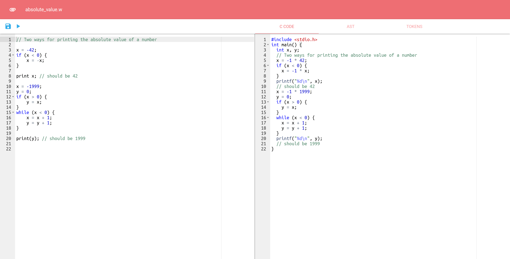

# WHILE Language Transpiler

Transpiler written in Python to convert WHILE source code to C.

## Installation

### Build from source

1. Clone this repository.
2. Run `python setup.py install`.

## Usage

### Web App

The web interface for the transpiler can be started by running
```
whiletranspiler --web
```
in the directory with WHILE source code files that you want to edit. This starts a web server on port 5000.



### Command Line

To compile WHILE source code file named `test.w`:
```
whiletranspiler test.w
```
The default output C source code file is `out.c`. This can be changed with the `-o` flag.

To compile the transpiled C source code, include the `--gcc` flag. To execute the program, include the `--exec` flag.

#### Output Options

Command line flag options to control the output:

- Token Stream
    - `--token-stream`
- Parse Tree
    - `--parse-tree`
- Abstract Syntax Tree (AST)
    - `--ast`
- Display transpiled C source code
    - `--stdout`

### Plugins

The transpiler has a plugin interface so other Python modules can display data in the web interface or modify the data output by the transpiler.

Make sure the plugin is installed or in PYTHONPATH, then run `whiletranspiler` with the extra command line arguments `--plugin [plugin name]`.

## Testing

Run `pytest` to run test cases.

## Language Rules

```
Block ::= "{" Statement "}"

Statement ::= x "=" Expression
          |   "skip"
          |   Statement; Statement
          |   "if" "(" Condition ")" Block "else" Block Statement
          |   "while" "(" Condition ")" Block Statement
          |   "print" Expression
          |   "//" Comment "\n" Statement

Condition ::= "true"
          |   "false"
          |   "not" Condition
          |   "(" Condition ")"
          |   Condition binary_op Condition
          |   Expression comparison_op Expression

Expression ::= x
           |   n
           |   "-" Expression
           |   "(" Expression ")"
           |   Expression arithmetic_op Expression

binary_op  ::= "and" | "or"
comparison_op ::= "<" | "<=" | "==" | ">" | ">=" | "!="
arithmetic_op ::= "+" | "-" | "*" | "/" | "<<" | ">>" | "%"
```
Note that all variables in WHILE have global scope.

